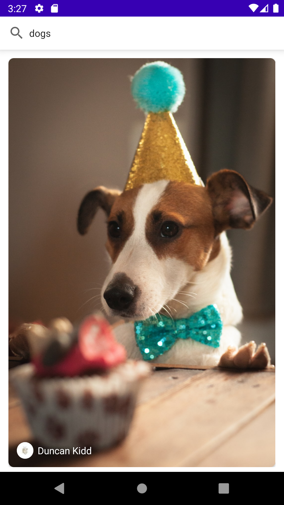
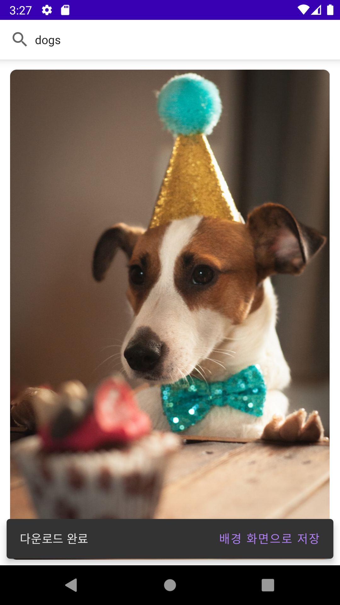
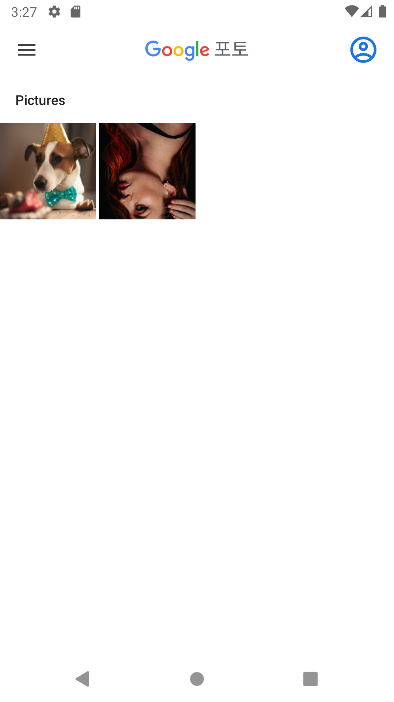
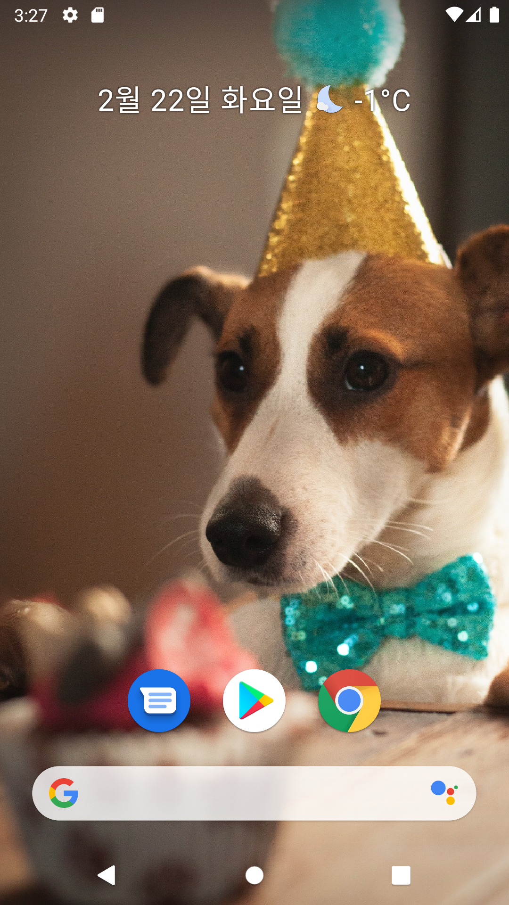

# Android Clone Coding Project #22 ImageSearch
Unsplash Api로 사진을 가져올 수 있음
 
검색한 사진을 다운 받을 수 있음
 
사진을 배경화면으로 설정할 수 있음
 
Loading Shimmer를 볼 수 있음
 
# 결과화면
|Screenshot1|Screenshot2|
|---|---|
|||
|||

 

# 배운 내용 정리
- Retrofit
- Coroutine
- Glide
- ShimmerLayout
- WallpaperManager
